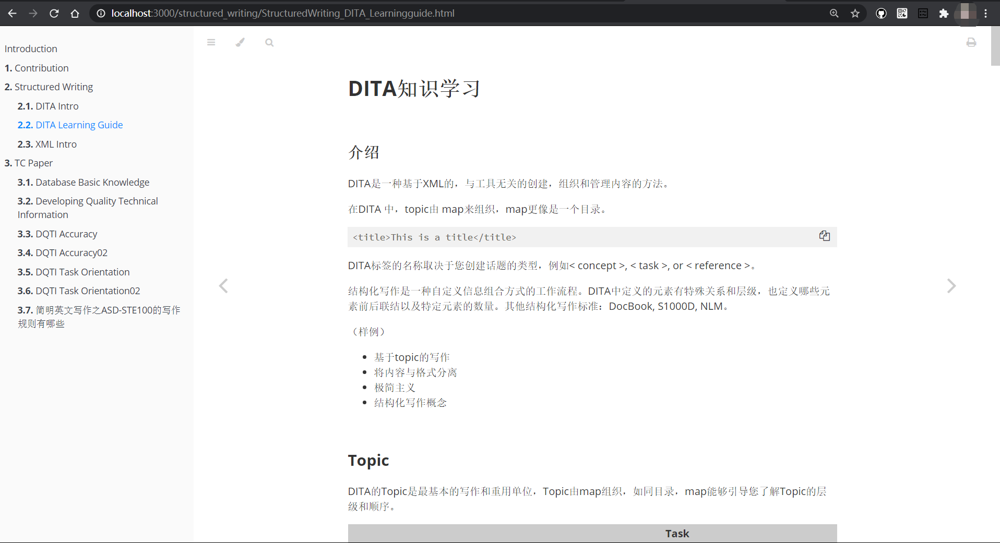

# Contributing

Welcome to the world of technical communication. Feel free to add your TC story in this repo. You can start from any one of the following items to help improve
this community:

- TC_Technology: The knowledge base about technology.
- TC_Paper: The knowledge base about technical writing.
- TC_Communication: Blogs about technology, technical writing and communication.

## Clone Repo

Fork my repo on [GitHub](https://github.com/ireneontheway/ireneontheway.github.io) and clone it.

```
git clone https://github.com/ireneontheway/ireneontheway.github.io 
```
## Create a new branch

1. Get your local master up-to-date with upstream/master.

2. Create a new branch based on the master branch.

## Commit and push your changes

1. Keep your branch in sync with upstream/master

```
# While on your new branch
git fetch upstream
git rebase upstream/master
```

2. Push your changes to the remote

```
git push -u origin new-branch-name # "-u" is used to track the remote branch from origin
```

## Create a pull request

1. Visit your fork at https://github.com/$user/ireneontheway.github.io (replace `$user` obviously).
2. Click the `Compare & pull request` button next to your `new-branch-name` branch.

## Directory structure

The directory structure is maintained in the `SUMMARY.md` file.
After starting `mdbook`,it will automatically generate directories 
and files according to the `SUMMARY.md`.The commands to start document 
preview under each system are as follows:

- Window

```
bin\win\mdbook serve
```

- Mac

```
bin/mac/mdbook serve
```

- Linux 

```
bin/linux/mdbook serve
```

-  Mac and Linux systems need to give mdbook executable permission：

```
sudo chmod 755 bin/mac/mdbook

sudo chmod 755 bin/linux/mdbook
```

## Write articles

The document is written under `./src`, you can use mdbook to preview.
Mdbook manual is [here](https://mdbook.budshome.com).


## Preview

After executing the above command, you can open 
[`http://localhost:3000/`](http://localhost:3000/)
 with your browser to preview articles.


