# A trip to TiDB

# Intro 

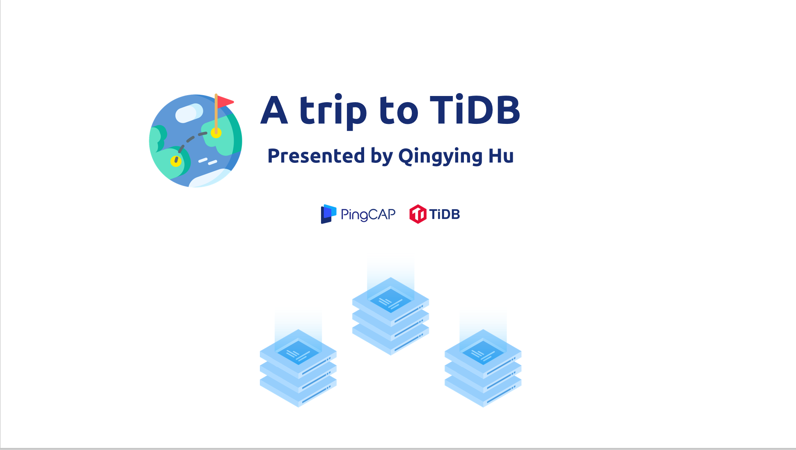

Good afternoon,ladies and gentlemen!  You are welcome to visit  the city of TiDB. My name is Irene. It's my honor to be your tour guide. Now we are taking the Pingcap Airline flight No. I18N. Our flight will take about 30 minutes to the destination. Before landing, let me show you an overview of TiDB.

## Basic concept - ACID

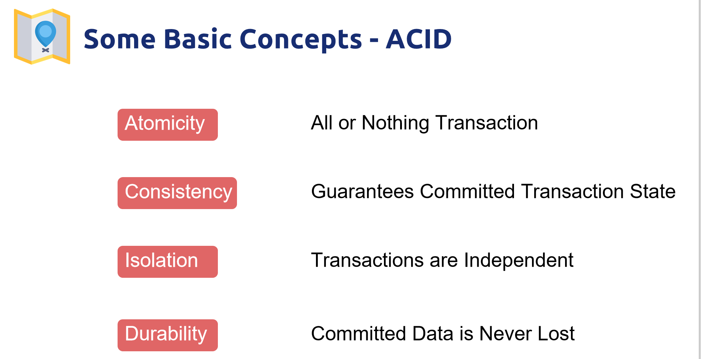

First of all let me introduce some basic concept of database. Just like the traditional habits in your human world. Understanding them help you know TiDB better.

First is about ACID. It is the abbreviation of Atomicity, consistency,isolation and durability.

- Atomic: A transaction is an indivisible minimum unit of work. It means either all the statements in the transaction are applied to the database or none are applied. 
- Consistent: The database always transitions from one consistent state to another consistent state.
- Isolated: Isolation is used to define the degree of mutual isolation between transactions. While multiple transactions can be executed by one or more users simultaneously, one transaction should not see the effects of other in-progress transactions. 
- Durable: Once the transaction is committed, the changes made will be permanently saved in the database

## Basic concept - OLTP + OLAP

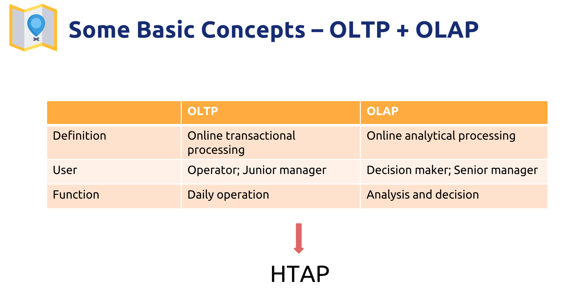

Next concept is OLTP  and OLAP. I made a table to compare the difference between them.

OLTP is Online transactional processing. OLAP is Online analytical processing.

The users of OLTP are Operators and Junior managers. They use OLTP for Daily operation. The users of OLAP are mainly Decision maker; Senior manager. They use OLAP for Analysis and decision. Different from OLAP, OLTP require real-time response. 

To combine the functions and advantages of these two technology , HTAP appears.

It is Hybrid Transactional and Analytical Processing, an emerging application architecture. TiDB belongs to HTAP. It supports 100% OLTP + 80% OLAP. So It breaks the wall" between transaction processing and analytics.

## History 

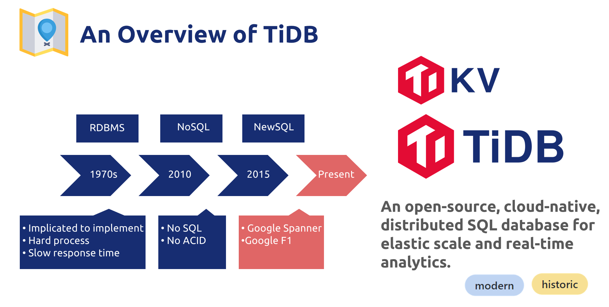

Our city always regard as an open-source, cloud-native, distributed SQL database for elastic **scale** and real-time analytics. Actually, it is a modern city with long history, which can be traced back to the 1970s.   The begining of the database.

From RDBMS, NoSQL to NewSQL , different types of databases evolve to meet different needs. 

However, RDBMs is complicated to implement and hard to process.  Its response time is slow when facing with huge amount of data. NoSQL does not fit for complicated scenarios or transactions and has no ACID transactions. . And then a new solution to these problems appear. That is newSQL, such as google Spanner and Google F1.  It combines the advantages  of RDBMS and NoSQL. And handles the limitations of them. TiKV and TiDB basically correspond to Google Spanner and Google F1, which are rebuilt by using Open Source. 

Therefore, based on the latest technology and long history, TiDB is modern and shows us historic reform in the database development.

## Overview 

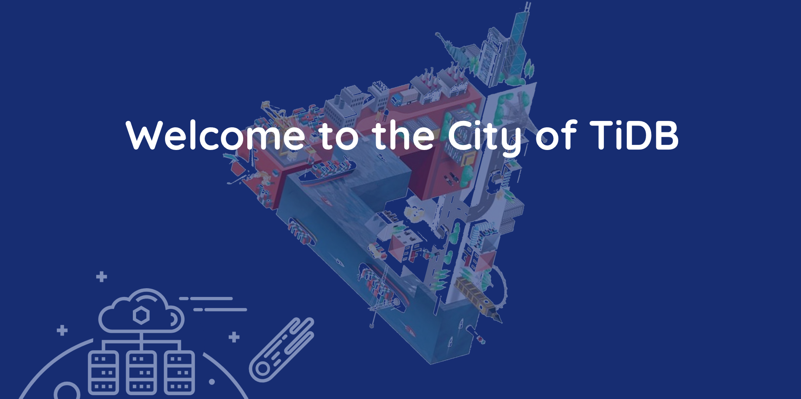

So Welcome to the city of TiDB. Today we'll have a sightseeing in this modern city. As a database, TiDB has a collection of data residents. As a database management system, TiDB uses a systematic way to manage its citizens.  Create, retrieve, update and delete data.

# Architecture 

This is TiDB City Map. It shows the basic architecture of TiDB city. 

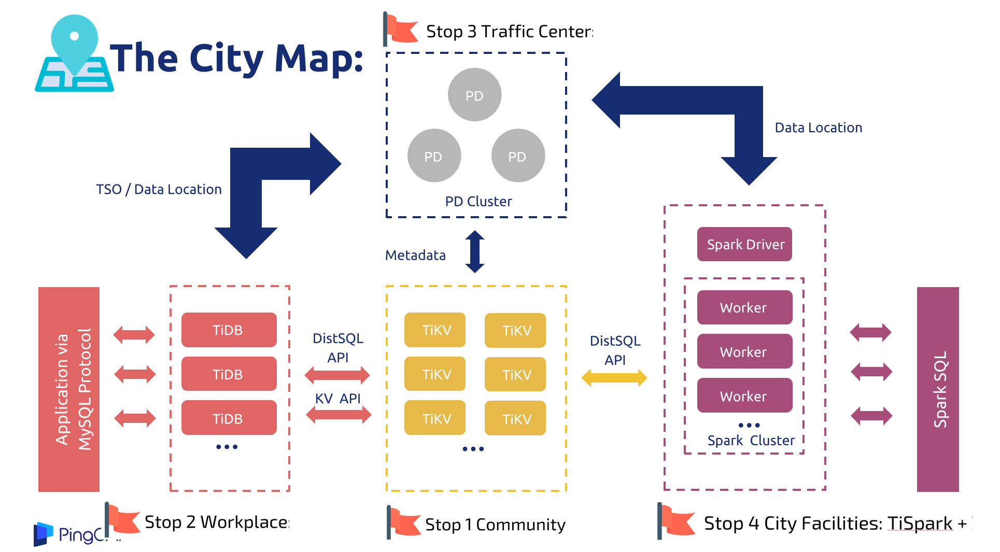

●TiKV is the community in the city: It is responsible for storing data, essentially is a KV storage engine

●TiDB is the workplace in the city: It receives the SQL request, finds the data stored on TiKV through the metadata in the PD, and interacts with TiKV to return the result to the users.

●PD cluster is the traffic center in the city: It is the manager of the cluster mainly stores metadata, performs load balancing, and assigns a globally unique transaction ID.

●TiSpark is one of the city facilities: as a component, it solves users' complex OLAP query requirements.

Also, there are other convenient facilities like TiDB Lightning and TiDB Operator (Facilitate the deployment of components on the cloud). I'll cover them later.

This map shows our itinerary of the trip. So let's go to the first top. 

# Stop 1 Community: TiKV

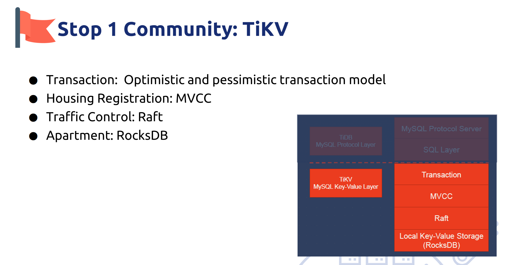

- Transaction: The transaction model is inspired by Google's **'Percolator**. It adopts optimistic locking model, which means during the transaction, conflicts between writes will not be detected. Only during the submission process will the conflict detection be performed. **The earlier completion of the submission** between the two parties in the conflict will write successfully, and the other party will try to execute the entire transaction again.
- Housing Registration: MVCC provides concurrent access to the database without locking the data. MVCC in TiKV is achieved by adding Version after the Key. It seems like making Housing Registration for our data residents.
- Taffic Control: With Raft, we can copy data to multiple machines to prevent single machine failure. Raft is an important transportation way in our city, which can be called as a consensus algorithom. It is very important in TiDB. I'll explain it further in the next slide. 
- Apartment: Through the stand-alone RocksDB, we can quickly store data on the disk. So RocksDB seems like the apartment for the data residents.

## Car : Region 

Like the human world, in TiKV, we also have vehicles for transportation.  It is called region. A region is a basic unit of data movement. 

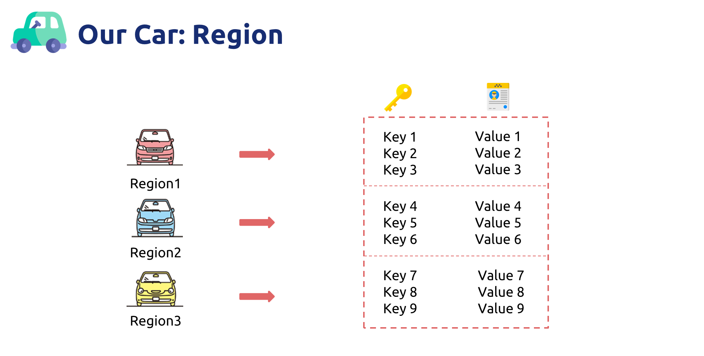

In human world, we have to own a key and a license so that we can drive the car. The same with TiKV,  TiKV is a huge map that stores Key-Value pairs. TiKV divides the entire Key-Value space into many segments. Each segment is a series of consecutive Key-Value pairs, we call each segment a Region. And we will try to keep balanced number of data stored in each Region that will not exceed a certain size.

## Traffic Control: Raft 

In human world, too many cars crowded together will cause traffic jam. So we have traffic control system. In TiKV, this is called Raft. More than the traffic control system can do in the real world, Raft can deal with the single point of failure so that maintain the auto failover. 

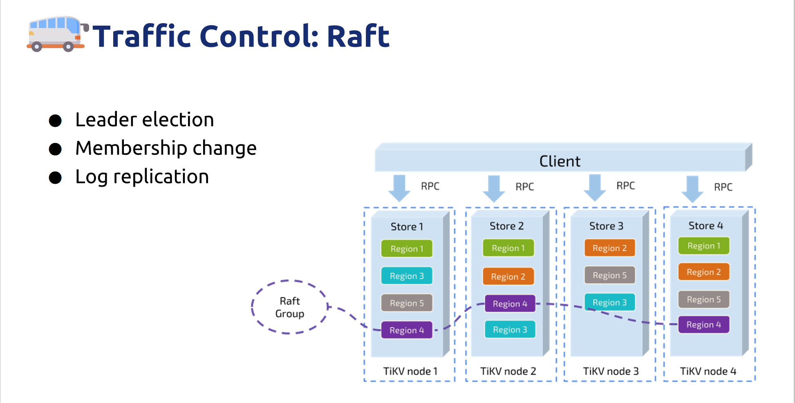 

There are three main functions of Raft:

- Leader election
- Membership change
- Log replication

Region corresponds to a data range in a Store. Each Region is replicated to multiple Nodes. A replica of a Region is called a Peer. These multiple replicas form a Raft group, just like a car group in the human world. Also, raft will elect a group leader for better management. The leader accepts data from the client and sends data to followers.  Followers receive data from the leader and response to the leader.

TiKV uses Raft for data migration, and every data change will be implemented as a Raft log. Through the log replication function of Raft, the data can be safely and reliably migrated to most nodes in the Group.

It also has interesting rules of membership change. Due to the time limitation, I will not explain it further.

Ok , now we've finished visiting our first stop that is about the life and transport of TiKV. Let's go to the second stop that is about computation.

# Stop 2 Workplace: TiDB

Stop 2 is the workplace in TiDB. For the data residents inside it, their daily work is about computation.

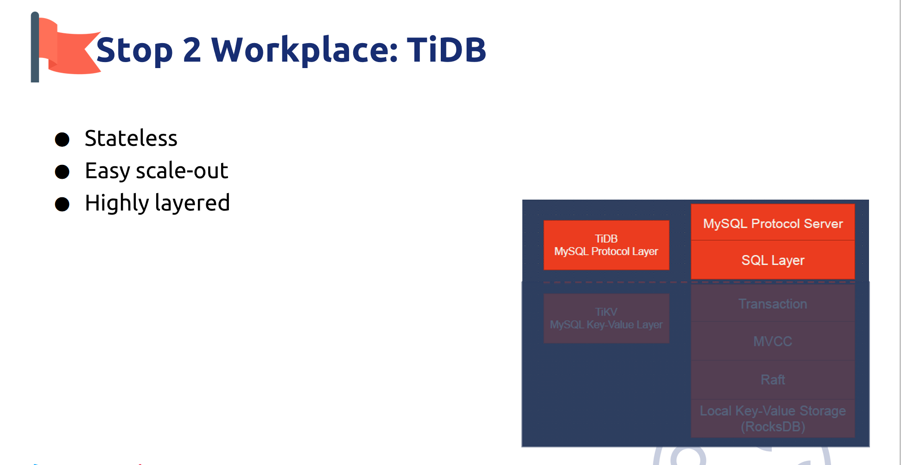

TiDB is highly layered and stateless. 

TiDB Server can directly expand the machine, which is transparent to users and has no upper limit. 

The SQL layer of TiDB is much more complex, with many modules and layers. TiDB map SQLs queries to KV queries, then obtain the corresponding data through the KV interface, and finally perform various calculations.

# Stop 3 Traffic Center: PD

Next stop is the traffic center of TiDB. It is the placement driver. The traffic center includes traffic control systems as I mention above the  Raft. As the director of TiDB, PD provides the God’s view of the entire cluster and work hard to keep the data flow safe and balanced.

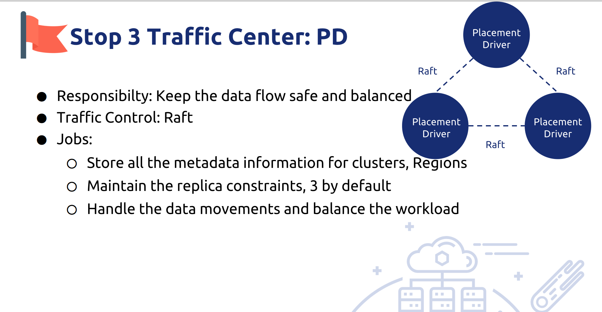

Its  jobs are:

- Storing all the metadata info for clusters, regions

- Maintaining the replica constraints, 3 by default

- Handling the data movements and balances the workload

So how does the traffic center work? What's the relationship between Raft store and PD. 

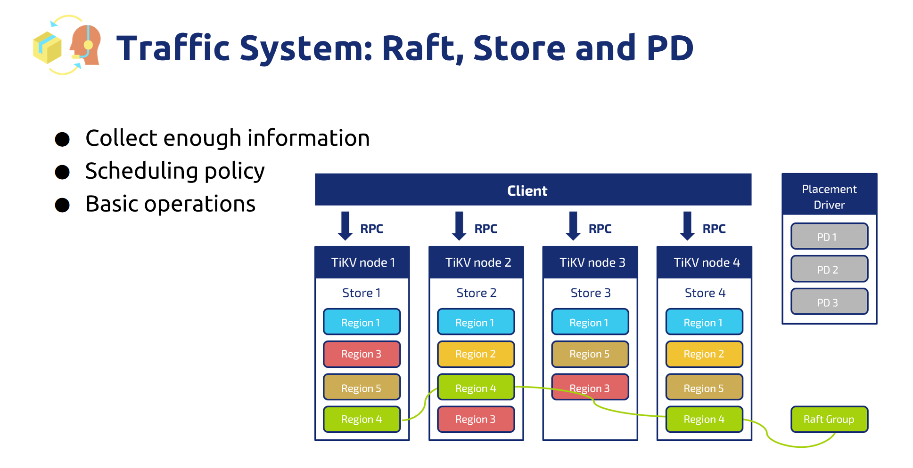

PD does its job by..

- Collect enough information

The PD collects information through the heartbeat from TiKV node and heartbeat from the leader of Raft Group;

 and PD obtains detailed data of the entire cluster. Extracts info through management interface

- Scheduling policy

It produces scheduling operations based on this information and some scheduling policy.

 It has many Scheduling policy, such as

1. The number of Replicas in a Region is correct:
2. **Multiple Replicas in a Raft Group are not in the same position:**

- basic operations

Each time the PD receives a heartbeat from the Region Leader, the PD checks whether there is any operation to be performed on this Region, and returns the required operation to the Region Leader through the heartbeat. And then PD checks the execution result in the subsequent heartbeat.

Let's move to  the last stop, our city facilities. more than TiSpark

# Stop 4 City Facilities: TiSpark + TiDB Lightning 

TiSpark is an OLAP solution that runs Spark SQL directly on TiKV. It takes advantages of both the Spark platform and the distributed TiKV cluster and seamlessly glues to TiDB, the distributed OLTP database, to provide a HTAP solution to serve as a one-stop solution for both online transactions and analysis.

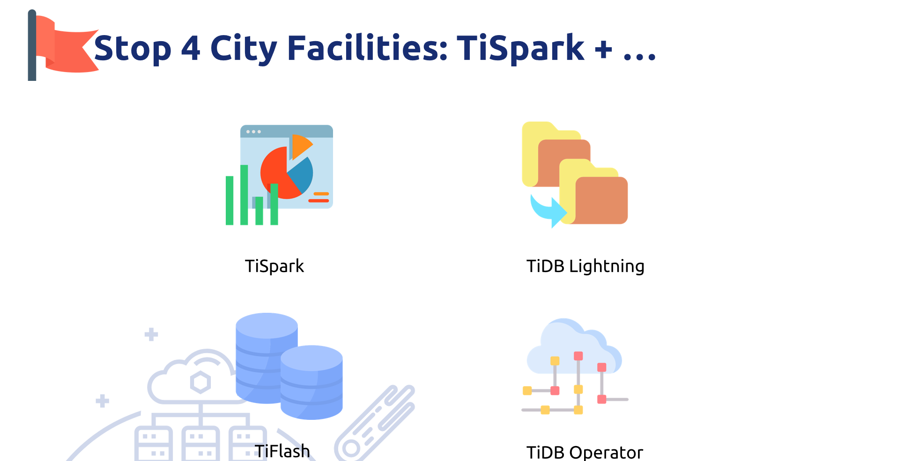

[TiDB Lightning](https://github.com/pingcap/tidb-lightning) is a tool used for fast full import of large amounts of data into a TiDB cluster. You can use it to

- Import **large amounts** of **new** data **quickly**
- Back up and restore all the data

TiDB Operator is an automatic operation and maintenance system for TiDB clusters on Kubernetes. It provides TiDB full lifecycle management including deployment, upgrade, capacity expansion, backup and restoration, and configuration changes. With TiDB Operator, TiDB can run seamlessly on public cloud or privately deployed Kubernetes clusters.

# Why we choose TiDB

Dear friends，our trip will be over soon. Before leaving,  I'd like to make a conclusion on the features of our city.

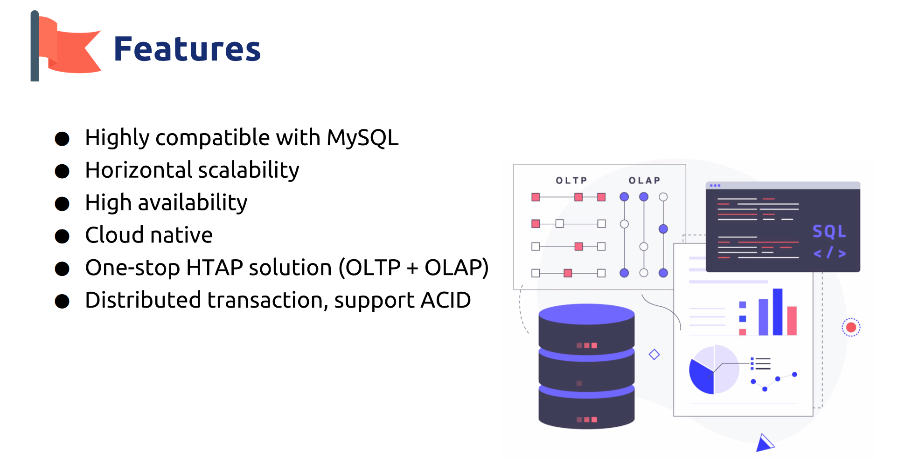

- Highly compatible with MySQL

- Horizontal elastic scalability can cope with high concurrency and mass storage
- use Raft to ensure consistency to keep high availability, especially real financial high availability,

- We have lots of convenient facilities, such as TiDB operator. It enables TiDB to be a Cloud native SQL database, supporting public cloud and private cloud

- TiDB is an One-stop HTAP solution

- It supports distributed transaction, support ACID transaction,

That is all the reason for us to choose TiDB.

# The end

The time has gone by quickly and your trip to TiDB drawing to a close. Hope you enjoy your trip. Thanks for your support.

> 本文主要内容参考自 TiDB 官网博客，仅作学习分享。作者：胡清莹 
>
> 如需转载请注明作者与来源。