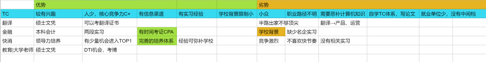

# First job 求职日记

写此日记纪念人生中的第一份工作。

有些工作就像爬山，路径是明确的，攀登的过程是艰辛且枯燥的，比如说医生、律师、教师。有些工作就像探险，前方遍布荆棘，迷雾重重，不知道下一步是惊喜还是惊恐，比如说我选的工作 technical writer （技术文档工程师）。

从本科毕业考上研究生我就在思考该做怎样的工作，一份我能接受的工作最起码要有这样的特点：

- 能做：能够利用得上我二十几年学习的知识和技能。
- 不排斥做：不会让我觉得非常痛苦，如果是感兴趣的就更好了。
- 能养活自己：达到上海平均月薪且不会累到猝死。

于是乎 2020 年的春节我给自己粗略画了一张竞争力分析图，长这个样子：

总结来总结去，其实在写的时候就已经决定了要做 technical writer。不是因为理性分析觉得综合竞争力最强，因为我发现我喜欢**冒险**。

我做很多事情虽然看起来是定了目标定了计划，但基本上都没有按计划走，而是随着直觉走的。只是说利用某种分析方法看起来仿佛是数据分析的结果，其实是为了进一步说服自己。就像写论文一样，先是脑子一拍写个论点，然后再找各种例子佐证，就算没法佐证，只要我很想做其他就不管了，干就完事了。

回过头来看求职的时候做的事情很简单，投简历-复盘-实习-复盘-投简历，就是这个循环。但是每一步该踩的坑一个都没有漏掉。

## 打怪升级线路

### 2020.3-2020.4 

- 参加商赛：花了两个月，从分析欧莱雅基础报告开始到最终做出app模型，获得了合格证书。

  因为沟通问题和队友QQ上大吵一架，让我明白了三件事。**一是在找合伙人的时候要找水平相当的人合作说清楚诉求和工作大致计划；二是信任队友注意表示尊重，交给别人做的事情，自己只给建议不不要过多插手；三是合作中出现了问题必须及时沟通，坦诚直接，不要弯弯绕绕，否则误会矛盾只会越攒越多理不清楚。**

- 投递实习：因为不知道做什么工作所以只要是大公司都投，包括金融、快消、财务、运营、四大等等。学校背景和实习经历不够基本上石沉大海。开始觉得**必须把力气集中到一个点上去做，发挥自己的长处进行错位竞争**，简历才有的写，才有可能获得体面的工作。于是，每天搜集国内外technical writer的工作机会、行业动态和学习资料。

### 2020.5

参加翻译大赛：腾讯、华为

主要是为了凑满 0.5 的学术成果分数、积累好的作品有利于找工作

### 2020.6

PingCAP 面试：是我主动联系的关注了很久的一位行业大佬推销我自己。面试中要求自我介绍、实习经历、技术写作理念、对数据库产品的理解等等。幸好我提前去B站自学了TiDB数据库的入门讲座。面试中会穿插英文交流，面试官非常尊重我，所以也慢慢从紧张到讲得流利起来了。

这次经历我意识到找工作不是考试，**只要我准备好，可以主动去找机会，而不是按部就班地被安排**。

### 2020.7

- 参与 PingCAP 实习：七月份顺利入职 PingCAP 进行远程实习。
- 建立个人 Github 网页 ：因为疫情在家，有了很多独自思考的时间和空间。坚持每周一篇文章堆在仓库里。感谢之前实现时认识的一个程序员小伙伴 @Francis Du 在站点提了 issue，并主动帮助我建立了 [Github 博客](https://ireneontheway.github.io/)。 **原来开源的力量无处不在，个人的影响力可以连接和放大**。这个博客网页为我后续推销自己起了很大的作用。

### 2020.8

- 思源华为杯获奖分享：万万没想到拿了一等奖，就是因为我运用到了技术传播自学的一些理论。我觉得在翻译技术的专业性上可能并不是最优秀的，但是别人的作品可能只是翻译，而我是创译+设计，**从阅读体验和视觉艺术上下了很多功夫**所以才突出重围的。这个比赛本身没什么，但是我因为它认识了当年讲座介绍技术行业的老师，并且获得了参与 tcworld 的志愿者机会。
- 获得华为简历内推机会：华为翻译中心主动问我的简历编号，当时全家以为稳进华为有点飘了。做着 PingCAP 的实习，心里想着华为，以为自己不得了了。但是三个月过去了，杳无音讯，可能是被我的简历劝退了= =，因为梦想的落空，至今对华为招聘怀恨在心(￢︿￢☆)。其实是太naive了，企业怎么可能不做任何面试就让你直接进去呢？又不是清华北大的nb人物。
- 定期更新 [Github 博客](https://ireneontheway.github.io/)：领导也有关注我的博客，提醒我**版权和原创申明**的问题。

### 2020.9

- 参加 tcworld 2020：作为学生志愿者参与了行业大会，发现这个圈子真的很小。
- [PingCAP 一个月学习总结](https://ireneontheway.github.io/TC_Communication/a_trip_to_tidb.html)：学到很多，发现我特别喜欢类比，觉得这样很生动形象呢。
- 身体抱恙：因为每天面对电脑打字，腱鞘炎和手肘部肌肉僵硬，只要开始打字手肘和手臂就很疼。

### 2020.10

- 结束 PingCAP 实习：手臂实在是吃不消，加上远程实习限制工作所以结束实习了。领导晚上花了三个小时和我沟通工作上的问题以及需要改进的地方，真的非常感动了。于是在辞职信里我写了“**山水有相逢**，我会不断成长，期望在未来的某一天再次与大家相见。”领导和mentor告诉我很多职场发展的建议：

  - 培养技术写作意识，把翻译升级为创译。

  - 分享任何内容注意版权问题。

  - 专业能力的基础是细心，自检是工作的必要流程：把初步做完的工作放在一边凉一凉等忙完另一个再回头检查。**一个任务交付必须经过三轮自检，建立个人checklist。**

  - 与其他部门同事沟通注意方式，交代清楚前因后果。

    - 已读不回，记得提醒。
    - 再不回，询问 leader,寻求从上而下的支持。
    - 维护部门形象，是重要且有价值的。

  - 件件有回应，事事有着落，凡事有交代。

    - 及时与上级平级沟通哪些可以自己决定，哪些需要向上反馈，知情权，传达。沟通到位有利于自己的工作。

    - 整理并**优化自工作流**，记录工作的问题，养成良好工作习惯。

    - 用多种方式沟通，预留时间，及时提醒，建立 jira issue 描述背景不容易忘。

  - **在工作中主动创造价值**

  - 项目管理是重要的技能 

    - 汇报进度、短期项目

    - 列清楚：时间节点和事件（注意DDL）
    - 突发事件的风险管理
    - 提前沟通
    - 信息拉平：重要的时间节点有产出必须要汇报、事情的落地情况要让leader有预期；要让所有利益相关人知道，在组里发布信息，定期总结

  - 远程工作：在结果上必须更注重严谨和专业
  - mentor 的工作流：
    - 工作日可以利用起来一小部分时间做和工作相关的有利于自己的思考，在更 high-level 看问题。

    - **每天的工作是要得到学习的**、有输入而不是机械的工具人。

    - 每天花一点时间去读书主动读 Read million posts: newspaper \ tech blogs

    - 整理要做什么事情、安排时间

    - 做事的过程中记录日报，晚上再总结 

    - 换位思考：把已知的东西清楚地表达出来再传递出去，把背景交代清楚。

    - Review: github看：翻译的时候就要注意细节回过头检查比较麻烦。

      - 先看文件层面的

      - 提了PR 先draft 再review 一遍

- 写毕业论文

- 参加室友婚礼，与mentor面基

### 2020.11

秋招：联影 + Zilliz

TW 的工作岗位大多都是社招，需要至少一年工作经验，当时接到以上两家实习offer的时候内心挣扎了好久，最后还是决定先去互联网软件的Zilliz，原来行业**同一个岗位的细分方向也是不同的**。

### 2020.12-2021.2

- 参与 Zilliz 实习：总得来说此次实习学到很多，踩了基本上能踩的所有坑。

  - 技术方面

  | **原因**                         | **提升计划**                                                 |
  | -------------------------------- | ------------------------------------------------------------ |
  | 基础技术原理一知半解             | **制定具体学习计划**。例如学习数据库、AI、计算机视觉处理、编程语言基础知识 |
  | 对 Milvus 项目的了解停留在表面   | 自行调研了解 Milvus 用户研读企业知识库资源                   |
  | 技术写作在实践中缺少自己的方法论 | 技术文档竞品研究确定写作的 **checklist** 起草前先确定篇章、段落、句子之间的**结构** |
  | 沟通问题                         | 调整提问的方式和对象，例如提问要具体有逻辑。 增加相关知识培训及时反馈，有始有终 |

  - 沟通方面

    - 一定要先了解所有技术、熟读知识库所有的东西、问东西才能问到点子上。

    - 知其然知其所以然，从宏观的角度理解任务需求。

    - 现有自己的思路然后再和老板沟通，问清楚问明白了。

- 旁听线上技术传播会议

- 面试：百度、SAP、蚂蚁金服

### 2021.3

- 春招：西门子、远景智能、易保
- 研究生毕业答辩
- 用 Soul 获得远景内推，加速简历关
- 与远景签订三方协议

### 2021.4

- 研究生毕业旅行：广州自由行
- 参与远景提前实习

## 达成成就

- [x] Offer 5/10

  很幸运能够抓住校园招聘的尾巴，顺利以校招生的身份进入一家比较适合自己的企业。以下是我参与秋招与春招的求职记录，中标率50%。

- 秋招：

| PingCAP（校招）               | 华为                      | 联影（校招）                             | Zilliz                                   |
| ----------------------------- | ------------------------- | ---------------------------------------- | ---------------------------------------- |
| X远程实习主动性欠缺；Base北京 | X主动邀请我投简历后无音讯 | &hearts;婉拒：医疗器械方向且只写中文文档 | &hearts;婉拒：公司管理以及新人培养不合适 |

- 春招：

| 百度                    | SAP                     | 蚂蚁金服                                              | 西门子                                                       | 远景智能（校招） | 易保                                 |
| ----------------------- | ----------------------- | ----------------------------------------------------- | ------------------------------------------------------------ | ---------------- | ------------------------------------ |
| X三面挂；缺少系统性思维 | X笔试挂；英文写作速度慢 | X通过三面；人才筛选流程长时间慢；Base杭州；工作压力大 | &hearts;婉拒：福利好待遇差；工作内容比较枯燥只需会用office软件 | &hearts;&clubs;  | &hearts;婉拒：只接受实习以及转岗入职 |

（&hearts; 表示收到 offer；&clubs;表示接受offer；X表示未通过或在流程中）

- [x] 思源华为杯一等奖
- [x] 在外部 Contributor 帮助下建立个人网页：https://ireneontheway.github.io/
- [x] 在实习中结交良师益友
- [x] 用 Soul 获得内推
- [x] 成为行业会议 tcworld2020 志愿者

## 技能升级

- [ ] 技术：
  - 编程语言 Python+CSS
  - 物联网技术
  - 计算机相关概念
- [ ] 设计
  - 极简主义
  - 以用户为中心的内容设计
  - 审美、色彩、排版
- [ ] 传播
  - 翻译、语言学
  - 国外高校培训
- [ ] 产品
  - 学习产品及竞品
  
  - 了解物联网生态圈
  
  - 国内外开源社区生态
  
    

## 踩坑心得 tbc

1. 实习工作时如何提高效率和沟通效果？
2. 如何在行业中建立个人品牌？
3. 如何在生活、工作、学习的平衡中保持创造力？