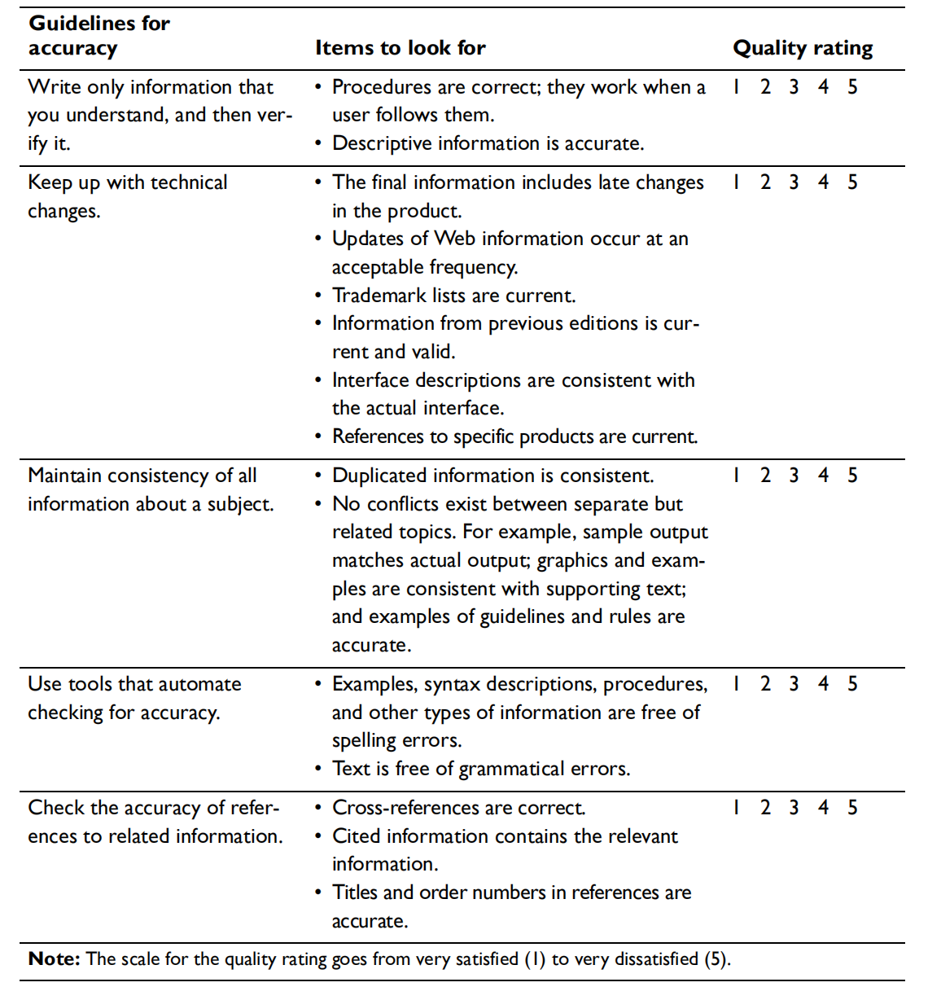

# Accuracy 02: be sure you are right, then go ahead

## 同一项目信息保持一致

准确性问题大多是因为同一项目中某部分更新了而别的部分没有更新。一个项目里多个不同版本的信息让用户搞不明白哪个信息是正确的。面对同一类信息需要重复使用时，可以使用“信息重用”保证信息的一致性。

当重用比较短的信息时，你当然可以使用简单 copy 操作。不过，如果遇到长文字重用，建议你使用 “Single source”. Single source 指的是同一来源，且改变不大的文本，但是交付形式不同。本书中的重用指的就是运用同一来源的信息。你可以设计一个 Topic 然后在不同形式的语境中使用，例如基于 HTML 或者 XML 的信息中心、 基于 Web 的文件、在线帮助或者出版书籍中。下图就详细解释了不同语境的信息重用：

只需在 source text 里更新, 不需要在众多版本中逐个更新。使用 “single source” 的另一好处是，假如你的写作工具支持条件文本（conditional text），你可以加入或排除一定的信息。使用条件文本指定特定情况下使用的特点 source 文本，这样提高了多文本信息重用的弹性。

以下几条规范有助于维持文本一致性：

- 尽可能重用信息
- 避免信息不一致

### 尽可能重用信息

| 重用场景                                     | 重用方式                                              |
| -------------------------------------------- | ----------------------------------------------------- |
| 产品窗口界面元件的帮助文本                   | 通过各个产品窗口链接访问帮助文本的单一来源            |
| 产品消息文本，用于展示讯息（印刷或在线信息） | 为产品和书籍编辑提供消息文本的单一来源                |
| 互联网、出版及其他在线格式                   | 对线上线下信息采取单一信息来源，不同交付方式          |
| 在线帮助或相关的出版信息                     | 为网络浏览器及展示用产品提供技术信息 topic 的单一来源 |
| 出版物、在线或网页形式的样板文本             | 多种书本的格式化工具对样板文本采用单一来源            |

使用单一来源不仅提高信息的准确性还节约了同步类似信息的时间。

### 避免信息不一致

并非所有信息都能重用。尽可能减少不必要的重复才能降低信息不一致的发生。比如说：

- 某一流程需要用户多次使用同一命令，在写作时考虑在步骤一时仅完整地写一次命令（如：(TRACE SYSTEM INFODBASE NEW DEBUG LOG=YES），接下来重复指令时，可以用 “the TRACE command shown in step 1.” 代替。

- 在网页中写作时，如果需要重复外部网页的信息，可以选择以下方式：

  - 解释内容并附上链接。好处是信息变动你无需更新自己的网页，不用为信息不一致负责，但是这样会降低用户使用体验，信息查找不便捷，而且外部网页可能会消失造成死链。
  - 将内容拷贝到自己的网页。有利于用户查阅，但是你就得不停同步信息了。

## 使用准确性自动检验工具

错误一般分语法错误和格式错误，网上可以查找到很多相关的工具进行检查。使用语法检查工具自动检验，可以检查被动语态、重复单词、模糊句段、长句等问题。这里列示一些我个人常用的工具：

- 语法检测工具：

  - Grammarly

    

  - LanguageTool
  
    

- 代码检测工具：

  - Code Spell Checker
  
    
  
- 专业翻译工具的质检功能
  - Yicat
  
    可以巧用专业计算机辅助翻译工具术语库的功能，建立属于自己的术语库，但要注意添加术语的准确性。

## 检查相关参考信息的准确性

需要关注以下参考信息：

- 参考信息的网址（保证网址能够及时更新）

- 出版物料的参考信息（包括标题、作者、出版商）

使用链接检测工具有利于找出死链及时修改，如github的插件CircleCI:

## DQTI 之 Accuracy 总结

保证文本准确性就是建立用户信任的基石。Accuracy 章节讲述了保证信息准确的几个要点：

> 本文主要内容来源于《Developing Quality Technical Information》，仅作学习分享。
>
> 如需转载请注明作者与来源。
