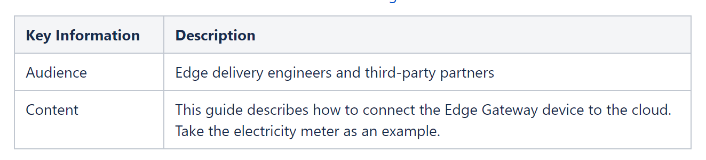
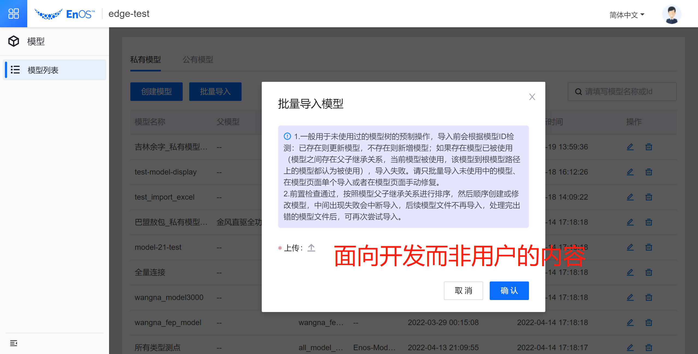

# Developing Quality Technical Information

在前一期文章中已经介绍了本书的主要框架：

> Easy to use

- task orientation
- accuracy
- completeness

> Easy to understand

- clarify
- concreteness
- style
  
> Easy to find

- organization
- retrievability
- visual effectiveness

今天就从 easy to use 入手，谈一谈第一个要求 task orientation （以任务为中心）

## task orientation

task orientation 指的是写作时注重指导用户如何完成任务。我们的用户一般都有本职工作需要完成，文档的作用是引导实用信息，指导他们如何操作。 TW要站在用户角度理解文档，在写文档之前对目标用户进行分析非常必要。分析出重要任务、常用任务、困难任务，并列出用户试用产品需要的高层次任务。

将高层次任务分解成低层次任务。例如将启动产品改成安装并设置产品。就像这样把问题结构成更低层次的任务，让用户一看就懂。任务型写作把用户拉回到任务上，就如同旅行中的指针为游人指明方向。为了做到这一点，写作时需要遵循以下规范：

> 1. Write for the intended audience
>
> 2. Present information from the user’s point of view
>
> 3. Indicate a practical reason for information
>
> - Relate details to a task where appropriate
>
> - Provide only a necessary amount of conceptual information in task topics
>
> 4. Focus on real tasks, not product functions
>
> 5. Use headings that reveal the tasks
>
> 6. Divide tasks into discrete subtasks
>
> 7. Provide clear, step-by-step instructions
>
> - Make each step a clear action for users to take.
>
> - Group steps for usability
>
> - Clearly identify optional steps
>
> - Identify criteria at the beginning of conditional steps
>

接下来我就一一介绍七条规范。

## 1.Write for the intended audience 为目标读者写作

写作前要明确目标读者，要确定写的是用户关心的问题，写作的信息详细程度取决于用户的类型。
- 如果是为管理者写作，写作只应该囊括高层次任务，例如评价和计划。
- 如果是为终端用户，就要避免写系统性管理任务。

## 2.Present information from the user’s point of view 从用户角度呈现信息

将用户拉入“故事中”，能够简单理解任务，因此写作包含以下特点：

- 英文中一般使用 “You”，中文中避免第二人称
- 使用主动语态，运用动词应该以用户视角
- 解释操作

以下错误示例的写作角度不够贴近读者：

> The system should not be shut down during processing. If such a shutdown occurs, the system should be restarted with the START RECOVER command.

应该改为：

> If you shut down the system during processing, you might lose data. Use the START RECOVER command to restart the system and recover any data from the log.

原版本行文语态是被动的，而且动作的发起者以及操作原因皆不明确。而修改后“you might lose data”就解释了此项操作的原因--- 避免丢失数据。

写作时要思考读者在哪一个步骤可能遇到的问题并提供相应信息，做到有的放矢。

## 3. Indicate a practical reason for information 表现信息的实用性

这条针对于 how-to 类的文档，要思考写这些内容的目的是什么，和用户完成任务有什么关系。保证内容是有实用价值的，需要遵循以下规范：

- 任务信息描述详略得当

  task topic 应该让用户明白传达此信息的目的。

- task topic 中只写入必要的信息：
  + 执行该操作的理由
  + 执行该操作的需要（例如前提或软件配置）
  + 执行操作的步骤
  + 后续操作的信息

不要混淆大量 conceptual 信息与 task 信息。用户只想知道怎么解决这一步操作而不想知道有关的知识。 task topic 中，尽早解释步骤，简述相关概念。

今天就先介绍这三点，下一期文章会继续阐释后面的四条写作规范。

> 本文主要内容来源于《Developing Quality Technical Information》，仅作学习分享。
>
> 如需转载请注明作者与来源。
