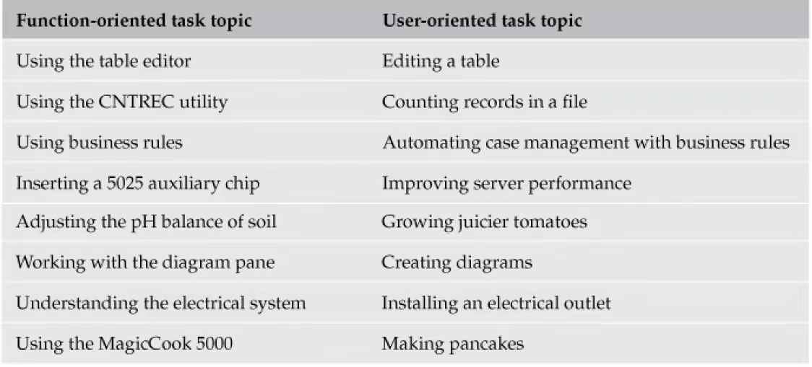
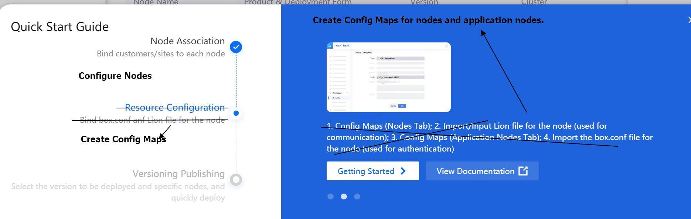
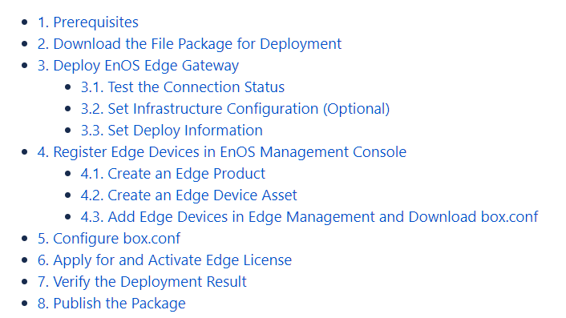

# TC_Paper_DQTI_task_orientation02

今天继续讲一讲 task orientation 的写作规范的其他内容。

## 4. Focus on real tasks, not product functions 关注使用而非功能

区分 real task（用户任务） 和 artificial task（产品任务），在技术写作过程中会逐渐忘记用户真正需要的任务而着重于产品中不必要的任务上，也就是陷入到 PRD 的语言中。

从用户执行角度编辑信息，拉近信息与用户的距离。

## 5. Use headings that reveal the tasks

标题的作用是告知用户为什么需要这个信息。topic的标题应该能够准确传达大致内容信息。避免使用假标题（pseudo-task），此类标题会误导用户：

- 假标题只展示了概念和参考类信息。
- 假标题混淆了真实的用户任务。

下图就是一个假标题的示例：

标题的作用是帮助用户找到信息，好的标题能让用户不看文章就知道哪些会是他们需要的信息。同时，也有利于信息重用。

> Register usage →  Linking with registers
>
> Administering authorization → Authorizing access to data
>
> The Dial-up function → Dialing up the computer
>
> Session initialization → Initializing a session
>
> Using the Define Font Window → Defining a font
>
> Understanding hardware requirement → Hardware requirement

标题除了“ing”还可以用“How to”或者“Steps for ...(n.)”的形式。目的就是以任务为中心让所有层次的用户都读得懂。

## 6.Divide tasks into discrete subtasks

确定主要任务后，要将他们分解成具体的子任务，这样可以在步骤层面提供有用的信息。每个任务或者子任务中的步骤应该不超过九步，每个子任务仅包含一个具体且完整的项目。

## 7.Provide clear, step-by-step instructions

大多数任务由步骤组成。偶有任务仅包含一个步骤可以独立成段，大多数都是一系列任务按顺序排列而成的。在写文档的时候留心是否是因为产品设计过于复杂导致帮助文档繁杂，毕竟越便捷易用的产品，帮助文档越少。

从用户角度组织步骤，思考任务如何相互联系?何时分解步骤？一个步骤中应该包含什么？等等问题。参考以下规范写出简明的文档：

- 每个步骤向用户提出一个清晰的操作任务

  为保证每一步骤都有明确指示，建议：

  + 在句首使用祈使动词，如“Type the date in the first column of the table.” 。
  + 先定位用户，如“In the first column of the table, type the date.”。

  例如：

  > 3.Click **OK**.
  >
  > 4.The installation begins.
  >
  > 5.After installation completes, restart your system.

  此里中 3 与 4 可以合并，这是因为 4 是 3 的结果。

- 根据可用性对步骤进行分组

  分组有利于用户在解决具体问题时快速定位，如果用户要不断根据指示点击用不了多久就头脑麻木了。

  > To add a setting to your profile:
  >
  > 1. Determine the name of the profile file that you want to add the setting to:
  >
  >     a. Right-click the profile object that you want and select **Properties** from the menu.
  >
  >     b. In the Properties window, find the name and path of the profile file.
  >
  > 2. Update the profile file with the new setting:
  >
  >    a. Open your profile file in a text editor.
  >
  >    b. Add the setting to your profile file in the settings section.
  >
  >    c. Save the profile file.
  >
  > 3. Run the profile command with the -file *YourProfileName* option.

  以上例句就是一个很好的分组案例，向用户表明步骤间的逻辑关系，表明了每个步骤对整体任务的作用，也能简化操作步骤。无序列表为用户提供同时可选的项目。

- 清晰指明可选步骤

  要保证步骤清晰，在最开头添上“Optional”这样用户即使跳过可选步骤也能完成任务。避免在后续文本中写上 “If you want to” or “You can” ，这样就显得多余了。

- 在条件步骤之前指明操作准则

  条件步骤是在特定准则下用户才能遵循的，因此一般以 “If,” as in, “If you run test cases in batch mode, complete the fields on the Batch page.”开头。指明这一点，让不需要的用户直接跳过。用户一般不会提前阅读接下去的步骤，因此要在一开始就指明接下来提供哪些信息作用于哪些场景。

以上就是 Task orientation 的主要内容， DQTI 这本书还在章节末整理了主要的写作规范供各位参考：

> 本文主要内容来源于《Developing Quality Technical Information》，仅作学习分享。
>
> 如需转载请注明作者与来源。
