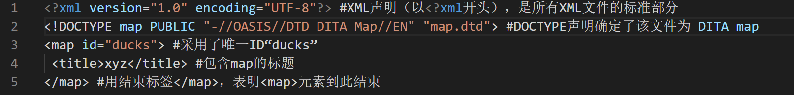
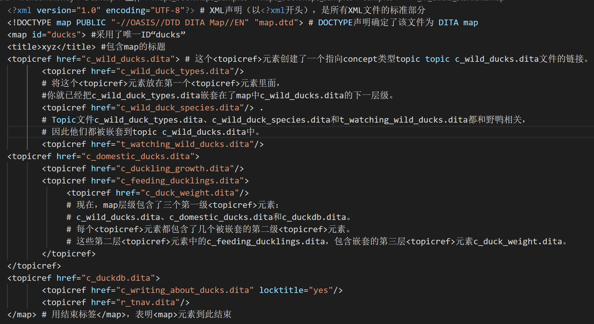
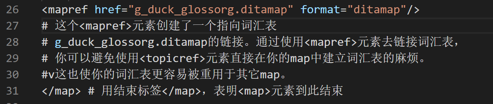

# DITA Map | [Lesson 1: 创建一个map](http://www.learningdita.cn/courses/5-使用dita-map和bookmap/lessons/lc_creating_a_map)

## ditamap 文件的定义和目的

- 联结 topic
- 导航的基础、联结内容
- 决定交付物展现的 topic
- 为满足用户需求，为工作流中一系列 topic 设定导航
- 在 topic 之间创建联系

Map 可以用来编辑、组织和定义 DITA topic 之间的关系。一个  map可以包含如下内容：

- 关于某个产品信息的所有 concept 和 reference 类型 topic
- 为该产品提供使用说明的所有 task 类型 topic
- 一个相关术语的词汇表

## 创建一个新的 DITA Map

Map 可以包含元数据，例如产品信息、版权和出版日期。Map 中的元数据可用来帮助你的公司更有效地管理和分发你的内容，或帮助你的顾客更轻松地找到所需内容。

一个 map 至少要包含一个根``<map>``（root `<map>`）元素。`<map>`元素可以包含以下元素：

- ``<title>``元素，允许你为 map 命名（例如“某产品的用户指南”）。`<title>`元素中的文本也可以用作输出文档的标题。
- 任意数量的`<topicref>`元素，允许你在 map 中引用 topic。一个`<topicref>`元素可以包含其它`<topicref>`元素。
- 任意数量的`<mapref>`元素，允许你在主 map 中引用其它 map。
- 任意数量的`<reltable>`元素，允许你定义内容之间的关系。

示例：



## 向一个 map 添加 topic 引用

`<topicref>`元素结构如下：

```
`<topicref href="filepath/filename.dita">`
```

href 属性包含一个链接，该链接指向 map 中某个 topic。DITA 规定，map 中`<topicref>`元素指向的 topic 位置不能高于 map 本身，否则会导致某些输出类型报错。因此，map 最好存储在最高一层。

`<topicref>`元素可能包含以下元素：

- `<topicmeta>`元素，定义关于被引用 topic 的元数据。
- 任意数量的`<topicref>`元素。
- 任意数量的`<mapref>`元素。

在嵌套`<topicref>`元素时，重要的一点是始终记得你的最终输出。DITA结构并不限制嵌套的`<topicref>`元素的数量限制，map中`<topicref>`元素可以包含任意数量的`<topicref>`元素。但是，每个被嵌套的`<topicref>`元素通常对应发布输出中的一个新的标题级别。所以，普遍认可的最好做法是，避免五层以上的`<topicref>`元素嵌套（最理想的是不超过二或三层）。



## 向一个 map 添加 map 引用

`<map>`元素结构如下：

```
`<mapref href="filepath/filename.ditamap" format="ditamap">`
```

href 属性包含了指向你的主 map 中引用到另一 map 的链接。format 属性明确了你正在链接到一个 DITA map。

`<mapref>`元素只能包含`<topicmeta>`、`<data>`和`<data-about>`元数据元素。按照 DITA 规定，不能在一个`<mapref>`元素中嵌套`<topicref>`或`<mapref>`元素。

就像`<topicref>`元素允许你在多个 map 中重用一个 topic 一样，`<mapref>`元素允许你重用很多 topic。通过一次性建立一个 map 并在其他 map 中引用该 map，你可以节约时间和精力，无需反复创建 map 中相同的系列，或具有相同层级结构的`<topicref>`元素。

除了重用，`<mapref>`元素为你提供了额外的内容发布灵活性。你可以在一个大的 map 中组合相关 map，这样你就可以为整个产品家族迅速交付所有内容。你还可以使用`<mapref>`元素来为 map 添加词汇表。



> 本文内容引自 [TC互联](www.learningdita.cn)，仅作学习分享。
>
> 如需转载请注明作者与来源。
