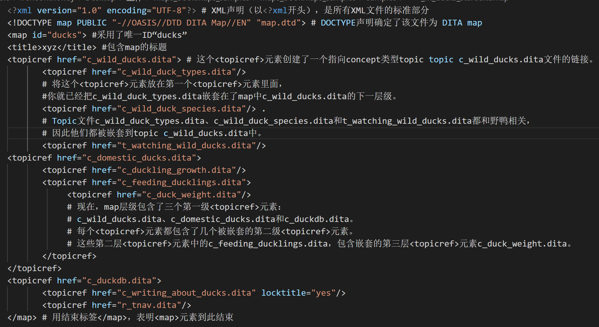

# DITA Map | [Lesson 1: 创建一个map](http://www.learningdita.cn/courses/5-使用dita-map和bookmap/lessons/lc_creating_a_map)

## ditamap 文件的定义和目的

- 联结 topics
- 导航的基础、联结内容
- 决定交付物展现的 topic
- 为满足用户需求，为工作流中一系列 topic 设定导航
- 在 topic 之间创建联系

Map 可以用来编辑、组织和定义 DITA topic 之间的关系。一个  map可以包含如下内容：

- 关于某个产品信息的所有 concept 和 reference 类型 topic
- 为该产品提供使用说明的所有 task 类型 topic
- 一个相关术语的词汇表

## 创建一个新的 DITA Map

Map 可以包含元数据，例如产品信息、版权和出版日期。Map 中的元数据可用来帮助你的公司更有效地管理和分发你的内容，或帮助你的顾客更轻松地找到所需内容。

一个map至少要包含一个根<map>（root <map>）元素。<map>元素可以包含以下元素：

- <title>元素，允许你为map命名（例如“某产品的用户指南”）。<title>元素中的文本也可以用作输出文档的标题。
- 任意数量的<topicref>元素，允许你在 map 中引用 topic。一个<topicref>元素可以包含其它<topicref>元素。
- 任意数量的<mapref>元素，允许你在主 map 中引用其它 map。
- 任意数量的<reltable>元素，允许你定义内容之间的关系。

示例：


## 向一个 map 添加 topic 引用

<topicref>元素结构如下：

```
<topicref href="filepath/filename.dita">
```

href属性包含一个链接，该链接指向map中某个topic。DITA规定，map中<topicref>元素指向的topic位置不能高于map本身，否则会导致某些输出类型报错。因此，map最好存储在最高一层。

<topicref>元素可能包含以下元素：

- <topicmeta>元素，定义关于被引用topic的元数据。
- 任意数量的<topicref>元素。
- 任意数量的<mapref>元素。

在嵌套<topicref>元素时，重要的一点是始终记得你的最终输出。DITA结构并不限制嵌套的<topicref>元素的数量限制，map中<topicref>元素可以包含任意数量的<topicref>元素。但是，每个被嵌套的<topicref>元素通常对应发布输出中的一个新的标题级别。所以，普遍认可的最好做法是，避免五层以上的<topicref>元素嵌套（最理想的是不超过二或三层）。



## 向一个 map 添加 map 引用

<map>元素结构如下：

```
<mapref href="filepath/filename.ditamap" format="ditamap">
```

href 属性包含了指向你的主 map 中引用到另一 map 的链接。format 属性明确了你正在链接到一个 DITA map。

<mapref>元素只能包含<topicmeta>、<data>和<data-about>元数据元素。按照 DITA 规定，不能在一个<mapref>元素中嵌套<topicref>或<mapref>元素。

就像<topicref>元素允许你在多个 map 中重用一个 topic 一样，<mapref>元素允许你重用很多 topic。通过一次性建立一个 map 并在其他 map 中引用该 map，你可以节约时间和精力，无需反复创建 map 中相同的系列，或具有相同层级结构的<topicref>元素。

除了重用，<mapref>元素为你提供了额外的内容发布灵活性。你可以在一个大的 map 中组合相关 map，这样你就可以为整个产品家族迅速交付所有内容。你还可以使用<mapref>元素来为 map 添加词汇表。


> 1本文内容部分引用自 [TC互联](www.learningdita.cn)，仅作学习分享。
>
> 如需转载请注明作者与来源。
